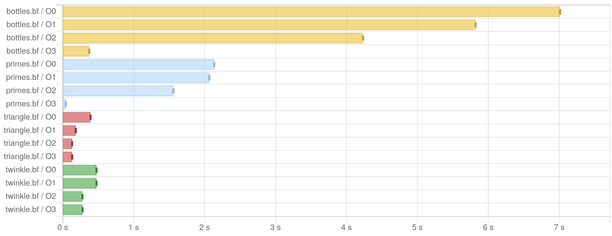

# BrainHask

A Brainfuck interpreter written in Haskell.


## Run

```shell
nix run github:damianfral/brainhask -- --help
```

```
brainhask - a brainfuck interpreter

Usage: brainhask (-i|--input FILE) [-o|--optimize OPTIMIZATIONLEVEL] [-a|--ast]

Available options:
  -h,--help                Show this help text
  -i,--input FILE          brainfuck file
  -o,--optimize OPTIMIZATIONLEVEL
                           optimization level (0|1|2) (default: 3)
  -a,--ast                 print the abstract syntax tree
```

## Benchmark


```shell
nix run github:damianfral/BrainHask#brainhask-bench -- --output criterion-report.html
```


